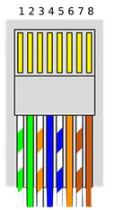

# picoHomeBoard
GPIO modul pro řízení žaluzií a topení

# Požadavky:
- 12 relé výstupů (1A/výstup) přez expandér (I2C)
- 12 vstupů přímo na GPIO
- indikační led výstupů, vstupů, komunikace a napájení :)
- rs485
- adresace (min 4b lepe 8b)

# Součástky:
- Rozvaděč podomítkový: (30x19x7.5)   SRp-12 P

# Přemýšlím
- Napájení pomocí UTP (z hlavního rozvaděče) - zdroj na desce
- 

# Zapojení

|Vodič|**modbus**|
|-|-----|
|1| VDD |
|2| VDD |
|3|  -  |
|4|485-A|
|5|485-B|
|6|  -  |
|7| GND |
|8| GND |